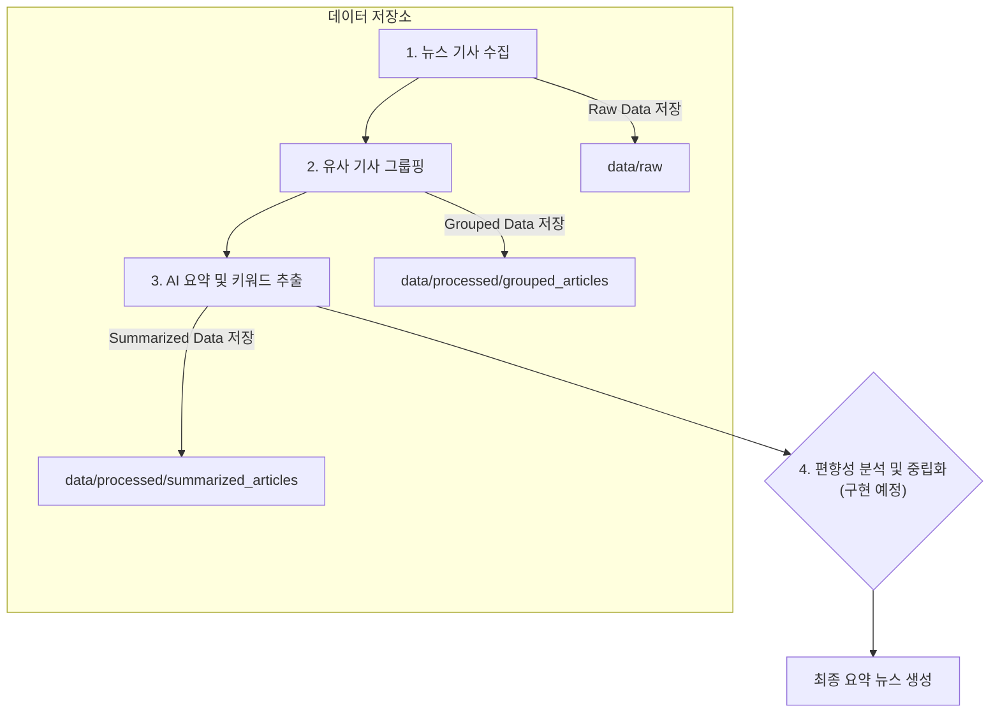

# 🤖 Breifit AI: 편향성 없는 AI 뉴스 요약 프로젝트

본 프로젝트는 여러 국내외 뉴스 사이트에서 기사를 수집하고, AI를 활용하여 편향성이 제거된 사실 기반의 요약 뉴스를 생성하는 것을 목표로 합니다. 사용자는 다양한 관점의 뉴스를 종합적으로 이해하고, 핵심 정보를 빠르게 파악할 수 있습니다.

## 🚀 주요 기능

-   **다중 소스 기사 수집**: 설정 파일 기반으로 여러 뉴스 사이트에서 원하는 카테고리의 기사를 자동으로 수집합니다.
-   **유사 기사 그룹핑**: 내용이 유사한 기사들을 하나의 그룹으로 묶어 동일한 사건에 대한 다양한 시각을 제공합니다.
-   **AI 기반 요약**: 그룹화된 기사들을 바탕으로 핵심 내용을 담은 요약문을 생성합니다. 이 때, 편향성을 제거하고
-   **편향,공격적인 단어 제거**: 

## 🛠️ 기술 스택

-   **언어**: Python 3.10.16
-   **데이터 수집**: `aiohttp`, `BeautifulSoup`
-   **설정 관리**: `PyYAML`

## 📊 프로젝트 워크플로우

아래 다이어그램은 본 프로젝트의 전체 데이터 처리 흐름을 보여줍니다.



## ⚙️ 실행 방법

### 1. 환경 설정

```bash
# 1. 저장소 클론
git clone https://github.com/your-username/Breifit_AI.git
cd Breifit_AI

# 2. 가상환경 생성 및 활성화 (권장)
python -m venv venv
source venv/bin/activate  # macOS/Linux
# venv\Scripts\activate   # Windows

# 3. 의존성 패키지 설치
pip install -r requirements.txt
```

### 2. 실행 스크립트

프로젝트는 단계별 스크립트로 구성되어 있으며, 순서대로 실행해야 합니다.

```bash
# 1단계: 뉴스 기사 수집
python scripts/run_collection.py

# 2단계: 수집된 기사 그룹핑
python scripts/run_grouping.py

# 3단계: 그룹 기사 요약 및 키워드 추출
python scripts/run_summarization.py
```

**참고**: 현재 NLP 관련 로직(`기사 그룹핑`, `요약` 등)은 실제 모델 연동 없이 임시 플레이스홀더 형태로 구현되어, 전체 데이터 흐름과 파일 저장 구조를 검증하는 데 초점을 맞추고 있습니다.

## 📂 폴더 구조

```
Breifit_AI/
├── configs/              # 뉴스 사이트 등 프로젝트 설정 파일
├── data/
│   ├── raw/              # 수집된 원본 기사 데이터
│   └── processed/        # 가공된 데이터 (그룹화, 요약 등)
├── scripts/              # 각 단계별 실행 스크립트
├── src/
│   ├── collection/       # 뉴스 기사 수집 관련 모듈
│   ├── processing/       # 기사 그룹핑, 요약 등 핵심 처리 모듈
│   └── utils/            # 공통 유틸리티 함수
├── tests/                # (예정) 테스트 코드
└── requirements.txt      # 의존성 패키지 목록
```

## 📝 향후 계획

-   **핵심 NLP 로직 구체화**: `src/processing/` 내의 임시 함수들을 실제 자연어 처리 모델 및 알고리즘으로 교체
-   **편향성 분석 및 제거 모듈 구현**: `scripts/run_bias_neutralization.py` 및 `src/processing/bias_neutralizer.py` 개발
-   **통합 파이프라인 구축**: `src/main.py`를 통해 전체 과정을 한 번에 실행하고 관리하는 기능 추가
-   **테스트 코드 작성**: 각 모듈의 안정성을 보장하기 위한 단위/통합 테스트 코드 추가
-   **API 서버 구축**: 요약된 뉴스 결과를 제공하는 API 서버 개발 (예: FastAPI)

## 🤝 기여 방법

프로젝트에 기여하고 싶으신 분은 언제든지 이슈를 생성하거나 Pull Request를 보내주세요.

## 📄 라이선스

본 프로젝트는 [MIT 라이선스](LICENSE)를 따릅니다.
